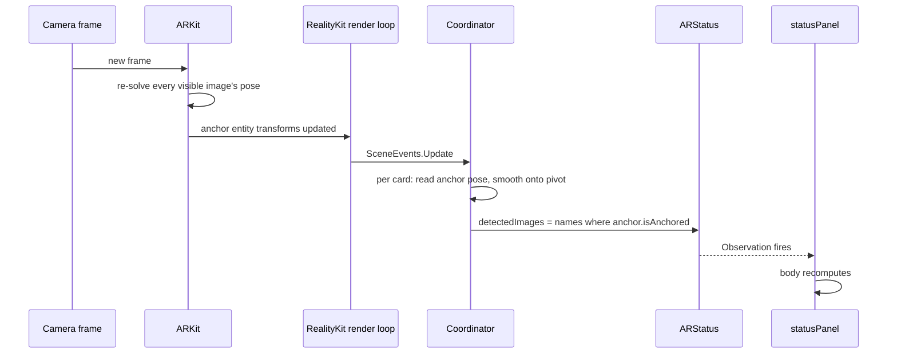

# The app shell

The SwiftUI side: the button, the camera screen, the bridge into UIKit, and the status panel.
Written for someone who can program but has not used SwiftUI before, because most of what looks
strange in the code is SwiftUI convention rather than anything to do with AR.

## Part 1 — The SwiftUI mental model

If you come from imperative UI (UIKit, Android Views, DOM manipulation, Swing), the habit is:
create a widget object, keep a reference, mutate it when data changes. `label.text = "hi"`.

SwiftUI inverts that. You never hold a widget and you never mutate one.

### Views are values, not objects

```swift
struct ContentView: View {
    var body: some View { ... }
}
```

`ContentView` is a **struct** — a value type. It is not the button on screen. It is a
*description* of what should be on screen, and it is cheap to create and throw away.

The framework calls `body`, gets a tree of description values, diffs it against the previous
description, and updates the real underlying widgets itself. Think React's virtual DOM, or an
immediate-mode GUI with retained-mode performance underneath.

The practical consequence: **`body` runs constantly**, potentially many times a second. So

- `body` must be cheap and free of side effects.
- You cannot store mutable state in a plain `var` on the struct. It gets discarded on the next
  recomputation, and structs passed into `body` are immutable anyway.

That second point is why property wrappers exist.

### `some View`

`some View` means "one specific concrete type conforming to `View`, chosen by the compiler, that
I am not going to spell out". It is an opaque return type.

It exists because SwiftUI's real types are absurd. A `VStack` holding a `Label` and a `Text` is
literally typed `VStack<TupleView<(Label<Text, Image>, Text)>>`, and every modifier wraps it
further. `some View` lets you skip writing that, while still giving the compiler one static type
to optimise against. It is not type erasure and it is not a protocol existential.

### Modifiers wrap, they don't mutate

```swift
Button("Start Scanning") { ... }
    .buttonStyle(.borderedProminent)
    .controlSize(.large)
```

`.buttonStyle(...)` does not set a property on the button. It returns a **new value** that wraps
the button and carries that styling. Each line wraps the result of the previous one, so this is
nested composition written as a chain — closer to `controlSize(buttonStyle(button))` than to a
sequence of setters.

Order therefore matters. `.padding().background(.red)` gives a red area including the padding;
`.background(.red).padding()` gives a red area inside it, with transparent padding around.

### State: `@State`

```swift
@State private var isScanning = false
```

`@State` is a property wrapper. It means: *SwiftUI, you own this storage, not the struct.*

The value lives in framework storage attached to this view's position in the tree, so it survives
every recomputation of `body`. When you write to it, SwiftUI marks the view dirty and schedules a
recomputation. **Writing state is what causes redrawing.** There is no `setNeedsDisplay`, no
`invalidate()`.

`@State` is for state a view *owns*. Always `private`.

### `$` and bindings

```swift
.fullScreenCover(isPresented: $isScanning) { ScannerScreen() }
```

`isScanning` is the `Bool`. `$isScanning` is a `Binding<Bool>` — a read/write reference to that
storage, roughly a getter/setter pair boxed into a value.

The distinction matters because the cover needs to *write* the flag, not just read it. Swiping
the sheet down sets it back to `false` from the inside. Passing the raw `Bool` would only pass a
copy, and the dismissal could never propagate back.

Rule of thumb: plain name to read, `$name` to hand someone else write access.

### Shared state: `@Observable`

`@State` handles one view's own value. `ARStatus` is different — it is written by the AR
coordinator living outside the view hierarchy entirely, and read by the overlay.

```swift
@Observable
final class ARStatus {
    var detectedImages: [String] = []
    var loadedModels = 0
    var totalImages = 0
    var errors: [String] = []
}
```

`@Observable` is a macro. At compile time it rewrites every stored property into a get/set pair
that reports reads and writes to the Observation framework.

That gives automatic, **property-level** dependency tracking. When SwiftUI runs `body`, it records
which properties were actually read. When one of those is written, only the views that read *that
specific property* recompute. You never declare the dependency; reading it is the declaration.

It is a `class`, not a struct, precisely because it needs reference semantics — the coordinator
and the view must see the same instance.

```swift
@State private var status = ARStatus()
```

`@State` here owns the *reference*, keeping the object alive across recomputations.
`@Observable` handles the change notifications. The two do different jobs.

## Part 2 — Walking the app

### Entry point

```swift
@main
struct PostcardARApp: App {
    var body: some Scene {
        WindowGroup { ContentView() }
    }
}
```

`@main` marks the program entry point. `App` is the top-level protocol; `Scene` is a window's
worth of UI. `WindowGroup` is the standard one — full screen on iOS, a real window on macOS.

### The button

```swift
struct ContentView: View {
    @State private var isScanning = false

    var body: some View {
        Button("Start Scanning") { isScanning = true }
            .buttonStyle(.borderedProminent)
            .controlSize(.large)
            .fullScreenCover(isPresented: $isScanning) { ScannerScreen() }
    }
}
```

Tapping sets `isScanning = true` → SwiftUI recomputes `body` → `fullScreenCover` now sees `true`
→ it builds `ScannerScreen()` and presents it.

Note what is absent: no navigation controller, no present call, no segue. You changed a boolean
and described what should be true when it is true. That is the whole paradigm.

### The camera screen

```swift
private struct ScannerScreen: View {
    @Environment(\.dismiss) private var dismiss
    @State private var status = ARStatus()

    var body: some View {
        PostcardARView(status: status)
            .ignoresSafeArea()
            .overlay(alignment: .top) { statusPanel }
            .overlay(alignment: .bottom) { Button("Close") { dismiss() } ... }
    }
}
```

`@Environment(\.dismiss)` pulls a value out of the environment — an implicit dictionary passed
down the view tree, similar to React context. SwiftUI puts a dismiss action in there for any
presented view, so the screen can close itself without knowing who presented it or holding a
binding back to it.

`.overlay` stacks a view on top of another, aligned within its frame — the same idea as `ZStack`,
but anchored to this specific view's bounds.

## Part 3 — Bridging to UIKit

RealityKit's `ARView` is a UIKit class (`UIView`), and SwiftUI cannot render one directly. The
bridge is a protocol:

```swift
struct PostcardARView: UIViewRepresentable {
    func makeUIView(context: Context) -> ARView { ... }
    func updateUIView(_ uiView: ARView, context: Context) { }
    func makeCoordinator() -> Coordinator { ... }
}
```

Three responsibilities:

| Method | When | Purpose |
|---|---|---|
| `makeUIView` | **Once**, on first appearance | Create and configure the UIKit view |
| `updateUIView` | Every time SwiftUI state it depends on changes | Push new values into the existing view |
| `makeCoordinator` | Once, before `makeUIView` | Create a persistent object for delegates |

`updateUIView` is empty here. Everything the AR view needs is set up once, and after that ARKit
drives itself from the camera rather than from SwiftUI state. Data flows *out* of the AR view
into the UI, not in. Leaving it empty is correct, not an omission.

### Why a coordinator exists

`PostcardARView` is a struct that gets destroyed and recreated on every recomputation. So it
cannot be a delegate — delegates are held weakly and must outlive the call that registers them.

The coordinator is a **class**, created once, owned by SwiftUI for the lifetime of the view. That
gives you a stable object to hand to old-style Objective-C APIs that expect delegates, targets, or
data sources. It is the standard escape hatch from value-type UI into reference-type frameworks.

Here it holds everything with a lifetime longer than one `body` pass — the session configuration,
the cards and their entities, their held poses, the render-loop subscription, and the model loads
— so `makeUIView` is three lines:

```swift
func makeUIView(context: Context) -> ARView {
    let arView = ARView(frame: .zero, cameraMode: .ar, automaticallyConfigureSession: false)
    context.coordinator.start(in: arView)
    return arView
}
```

The struct keeps only what SwiftUI hands it (`status`). Anything else stored on it would be
thrown away and rebuilt on the next recomputation.

## Part 4 — The status panel

This is the one place data flows back from AR into SwiftUI, and it is worth following end to end
because it exercises every concept above.



`Entity.isAnchored` is precisely "ARKit is tracking this card right now" — the label answers that
question exactly. The model does not: it keeps rendering at its last held pose while a card goes
untracked (occluded, say), rather than disappearing with the label — see "Tracking loss" in
[tracking.md](tracking.md). The two are allowed to disagree by design: the label reports live
tracking, the model stays put through a brief loss of it.

One detail that matters at 60 fps:

```swift
if status.detectedImages != detected {
    status.detectedImages = detected
}
```

`@Observable` does **not** compare values before notifying. Every set is a mutation as far as
Observation is concerned, so an unguarded assignment here would invalidate the overlay sixty times
a second and recompute `body` on every frame, forever. Guarding the write is what keeps it to the
handful of recomputations that correspond to real changes. The names are rebuilt into a fresh
array each frame — cheap for a handful of cards — and the comparison, not the rebuilding, is what
suppresses the notification.

Everything here runs **on the main thread**: `SceneEvents.Update` fires from the render loop, and
the session delegate uses the main queue because `session.delegateQueue` is left nil. That is why
there is no dispatching. If you ever set a custom delegate queue, the error handler would need to
hop back before touching UI state.

Then the chain: the write hits an `@Observable` property → Observation notifies whoever read it →
`statusPanel` read `status.detectedImages` during its last `body` → SwiftUI recomputes it → the
label flips to green.

No delegate protocol between the AR view and the UI, no notification centre, no manual refresh.
The dependency was established simply by reading the property.

### Why the panel reports several things

Tracking detection and loading separately is deliberate. When nothing appears on screen, the first
question is always *which half failed* — the image was never recognised, or the model never
loaded. One combined "working / not working" flag cannot answer that.

With several cards, both halves became counts rather than flags: which images are being tracked
right now, and how many of the models have loaded. `errors` is a list for the same reason — a card
whose `.usdz` is missing must not overwrite the message from the previous one. Repeats are dropped
on the way in, because `didFailWithError` can fire on every frame and the panel is a status
display, not a log.

What each line means when you are staring at it is in
[troubleshooting.md](troubleshooting.md).
