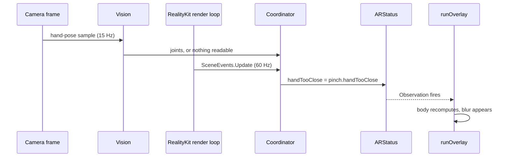

# The app shell

The SwiftUI side: the button, the camera screen, the bridge into UIKit, and how AR state reaches
the UI.
Written for someone who can program but has not used SwiftUI before, because most of what looks
strange in the code is SwiftUI convention rather than anything to do with AR.

## Part 1 — The SwiftUI mental model

If you come from imperative UI (UIKit, Android Views, DOM manipulation, Swing), the habit is:
create a widget object, keep a reference, mutate it when data changes. `label.text = "hi"`.

SwiftUI inverts that. You never hold a widget and you never mutate one.

### Views are values, not objects

```swift
struct ContentView: View {
    var body: some View { ... }
}
```

`ContentView` is a **struct** — a value type. It is not the button on screen. It is a
*description* of what should be on screen, and it is cheap to create and throw away.

The framework calls `body`, gets a tree of description values, diffs it against the previous
description, and updates the real underlying widgets itself. Think React's virtual DOM, or an
immediate-mode GUI with retained-mode performance underneath.

The practical consequence: **`body` runs constantly**, potentially many times a second. So

- `body` must be cheap and free of side effects.
- You cannot store mutable state in a plain `var` on the struct. It gets discarded on the next
  recomputation, and structs passed into `body` are immutable anyway.

That second point is why property wrappers exist.

### `some View`

`some View` means "one specific concrete type conforming to `View`, chosen by the compiler, that
I am not going to spell out". It is an opaque return type.

It exists because SwiftUI's real types are absurd. A `VStack` holding a `Label` and a `Text` is
literally typed `VStack<TupleView<(Label<Text, Image>, Text)>>`, and every modifier wraps it
further. `some View` lets you skip writing that, while still giving the compiler one static type
to optimise against. It is not type erasure and it is not a protocol existential.

### Modifiers wrap, they don't mutate

```swift
Button("Start Scanning") { ... }
    .buttonStyle(.borderedProminent)
    .controlSize(.large)
```

`.buttonStyle(...)` does not set a property on the button. It returns a **new value** that wraps
the button and carries that styling. Each line wraps the result of the previous one, so this is
nested composition written as a chain — closer to `controlSize(buttonStyle(button))` than to a
sequence of setters.

Order therefore matters. `.padding().background(.red)` gives a red area including the padding;
`.background(.red).padding()` gives a red area inside it, with transparent padding around.

### State: `@State`

```swift
@State private var isScanning = false
```

`@State` is a property wrapper. It means: *SwiftUI, you own this storage, not the struct.*

The value lives in framework storage attached to this view's position in the tree, so it survives
every recomputation of `body`. When you write to it, SwiftUI marks the view dirty and schedules a
recomputation. **Writing state is what causes redrawing.** There is no `setNeedsDisplay`, no
`invalidate()`.

`@State` is for state a view *owns*. Always `private`.

### `$` and bindings

```swift
.fullScreenCover(isPresented: $isScanning) { ScannerScreen() }
```

`isScanning` is the `Bool`. `$isScanning` is a `Binding<Bool>` — a read/write reference to that
storage, roughly a getter/setter pair boxed into a value.

The distinction matters because the cover needs to *write* the flag, not just read it. Swiping
the sheet down sets it back to `false` from the inside. Passing the raw `Bool` would only pass a
copy, and the dismissal could never propagate back.

Rule of thumb: plain name to read, `$name` to hand someone else write access.

### Shared state: `@Observable`

`@State` handles one view's own value. `ARStatus` is different — it is written by the AR
coordinator living outside the view hierarchy entirely, and read by the overlay.

```swift
@Observable
final class ARStatus {
    var annotatedShowcaseVisible = false
    var handTooClose = false
}
```

Both fields draw player-facing UI. There is no debug panel — diagnostics go to the console through
`Coordinator.report(_:)` — so a field here is a thing on screen, not a thing to look at while
debugging.

`@Observable` is a macro. At compile time it rewrites every stored property into a get/set pair
that reports reads and writes to the Observation framework.

That gives automatic, **property-level** dependency tracking. When SwiftUI runs `body`, it records
which properties were actually read. When one of those is written, only the views that read *that
specific property* recompute. You never declare the dependency; reading it is the declaration.

It is a `class`, not a struct, precisely because it needs reference semantics — the coordinator
and the view must see the same instance.

```swift
@State private var status = ARStatus()
```

`@State` here owns the *reference*, keeping the object alive across recomputations.
`@Observable` handles the change notifications. The two do different jobs.

## Part 2 — Walking the app

### Entry point

```swift
@main
struct PostcardARApp: App {
    var body: some Scene {
        WindowGroup { ContentView() }
    }
}
```

`@main` marks the program entry point. `App` is the top-level protocol; `Scene` is a window's
worth of UI. `WindowGroup` is the standard one — full screen on iOS, a real window on macOS.

### The button

```swift
struct ContentView: View {
    @State private var isScanning = false

    var body: some View {
        Button("Start Scanning") { isScanning = true }
            .buttonStyle(.borderedProminent)
            .controlSize(.large)
            .fullScreenCover(isPresented: $isScanning) { ScannerScreen() }
    }
}
```

Tapping sets `isScanning = true` → SwiftUI recomputes `body` → `fullScreenCover` now sees `true`
→ it builds `ScannerScreen()` and presents it.

Note what is absent: no navigation controller, no present call, no segue. You changed a boolean
and described what should be true when it is true. That is the whole paradigm.

### The loading screen, and what it is really for

Pressing **Scan a Card** does not open the camera. It opens onto `LoadingView` — the same screen
as `HomeView`, same background, grids and notched card, with the title replaced by a progress
read-out — and the camera screen replaces it once `ModelLibrary.isReady`:

```swift
@State private var library = ModelLibrary()

HomeView(action: {
    isScanning = true
    Task { await library.load() }
})
.fullScreenCover(isPresented: $isScanning) {
    if library.isReady {
        ScannerScreen(library: library)
    } else {
        LoadingView(loaded: library.loaded, total: library.total)
    }
}
```

**The library is `@State` on `ContentView`, above the `fullScreenCover`, and that placement is the
whole point.** A `fullScreenCover`'s content is built when it presents and destroyed when it
dismisses, taking `ScannerScreen`, its `ARView` and its `Coordinator` with it. Anything loaded
inside it is therefore loaded again on the next scan — which is exactly what used to happen: every
scan re-decoded both reference images and re-loaded both `.usdz` files, so the fifth scan was as
slow as the first. Owned one level up, the library outlives the cover, `load()` returns
immediately the second time, and `isReady` is already `true` — so the loading screen is seen once
per launch and never again.

The loading screen is not the fix for a slow load, and should not be mistaken for one. It makes
the wait *legible* rather than shorter: what actually made it short was moving
`ARReferenceImage.referenceImages(inGroupNamed:)` off the main thread and out of the view
presentation, and cutting the reference images down to a sane resolution — see "Resolution" in
[reference-images.md](reference-images.md). Loading behind a screen that says so is what is left
over, and it is worth having for a first launch on a cold device.

### The camera screen

```swift
private struct ScannerScreen: View {
    let library: ModelLibrary

    let close: () -> Void

    @State private var status = ARStatus()
    @State private var game = GameSession()
    @State private var annotations = AnnotationLayer()

    var body: some View {
        PostcardARView(status: status, game: game, annotations: annotations, library: library)
            .ignoresSafeArea()
            .overlay(alignment: .topLeading) { closeButton }
            .overlay { runOverlay }
            .overlay(alignment: .bottom) { showcaseHint }
    }
}
```

Two `@Observable` objects are created here and handed down. `status` only ever flows one way —
the coordinator writes, the panel reads. `game` flows both ways: the coordinator drives its clock
from the render loop, and **Start** / **Play Again** are buttons in `runOverlay` that change its
phase from SwiftUI. The coordinator notices those by comparing `game.phase` against the phase it
saw on the previous frame, rather than by being called — see [simulation.md](simulation.md).

`@Environment(\.dismiss)` pulls a value out of the environment — an implicit dictionary passed
down the view tree, similar to React context. SwiftUI puts a dismiss action in there for any
presented view, so the screen can close itself without knowing who presented it or holding a
binding back to it.

`.overlay` stacks a view on top of another, aligned within its frame — the same idea as `ZStack`,
but anchored to this specific view's bounds. A third, unaligned so it fills the whole screen,
carries the run's UI.

There used to be a pinch crosshair here too, drawn where the pinch point landed. It's gone —
nothing shows the pinch point on screen anymore. See "Grab, drag, release" in
[interaction.md](interaction.md) for what pinch pickup still does without it.

`runOverlay` is a `@ViewBuilder` switch over `game.phase`, one branch each for the instructions,
the 3 · 2 · 1, the score-and-clock HUD, the grace countdown and the result screen. Everything but
the HUD sits on the same dimmed backdrop; the HUD deliberately has none, because that is the one
screen where the coral has to stay visible, so its text carries a shadow instead of a panel.

The `playing` branch is the only one that stacks two things: `tooCloseNotice` under the HUD, drawn
while `status.handTooClose` holds. It is a `.ultraThinMaterial` rectangle — a *material*, not
`.blur()`, because the thing to blur is the camera feed rendered by `ARView` underneath, which a
modifier on the overlay's own content could never reach. The HUD is stacked above it so the score
and clock stay sharp, and the whole `ZStack` carries the `.animation(value:)` so the notice fades
in and out rather than snapping. Why the state exists at all is in
[interaction.md](interaction.md); the phase gate is in [simulation.md](simulation.md).

## Part 2b — Type, and how big it is allowed to get

Every font in the app is a named token in `DesignTokens.Typography`, and every screen reads one.
Nothing calls `Font.custom` with a literal size any more; the Figma numbers all live in that one
enum.

**Collecting them was not tidying — it was the fix.** `Font.custom(_:size:)` is not a fixed size.
It scales with the system text setting, and it scales relative to **`.body`** regardless of the
size handed to it. That is the right curve for an 18 pt paragraph and the wrong one for a 164 pt
numeral: body grows by roughly 130% at the largest accessibility setting, which put the countdown
digit on course for 380 pt inside a 282 pt card and the result score at 166 pt. Each token now names
the text style it actually resembles — display type to `.largeTitle`, the `3/8` in the progress
track to `.caption` — so each size grows on the curve Apple tuned for type of that weight.

Three things hold the layouts together, and all three are needed:

| Piece | Where | Does |
|---|---|---|
| The tokens | `DesignTokens.Typography` | puts each size on its own Dynamic Type curve |
| `accessibleLayout()` | once, on `ContentView`'s root | caps the range at `maximumDynamicTypeSize` |
| `fitsOneLine()` / `fitsBlock()` | at each site in fixed geometry | shrinks rather than wrapping, clipping or truncating |

### The cap is measured, not guessed

`maximumDynamicTypeSize` is **`.xxxLarge`**, and that number came from running the screens, not from
judgement. At `.accessibility1` the instructions card puts its title above the card's top edge and
its Start button below the bottom one: the content is simply taller than 439 pt by then, and no
amount of shrinking *inside* the column fixes a column that has run out of card. `.xxxLarge` is the
last step every panel still holds, and it is about a quarter larger than the default. Anything the
device asks for above that is clamped down to it, so a phone set to AX5 gets `.xxxLarge` here —
bigger than default, still inside the design — rather than an overlapping mess.

The cards are fixed-size images at Figma coordinates (344 × 439, with a 266 pt content column), and
that is the whole reason for a cap. **Raising it means giving the cards room first** — a card that
grows with its content — not simply moving the number up.

### Shrinking is the safety net, not the mechanism

The cap keeps text inside the layouts in the ordinary case. `fitsOneLine()` and `fitsBlock()` are
what make that guaranteed rather than hoped for, and they are why nothing clips if the tokens are
retuned later.

`fitsBlock()` exists because of a specific failure: when a fixed-height card cannot fit its column,
SwiftUI *truncates* the most compressible text in it, and on these panels that is the title.
"POINT AT THE CARD AGAIN" came out as "POINT AT THE CARD…". Shrinking a title by a fifth is
invisible; losing its last word is not.

Two places use `@ScaledMetric` instead of a font token — the `viewfinder` and `hand.raised` symbols
on the grace and hand-too-close cards, and the close button over the camera. `Font.system(size:)` is
genuinely fixed, so an SF Symbol sized that way would have been the one thing on the card that did
not grow with the words beside it.

## Part 3 — Bridging to UIKit

RealityKit's `ARView` is a UIKit class (`UIView`), and SwiftUI cannot render one directly. The
bridge is a protocol:

```swift
struct PostcardARView: UIViewRepresentable {
    func makeUIView(context: Context) -> ARView { ... }
    func updateUIView(_ uiView: ARView, context: Context) { }
    func makeCoordinator() -> Coordinator { ... }
}
```

Three responsibilities:

| Method | When | Purpose |
|---|---|---|
| `makeUIView` | **Once**, on first appearance | Create and configure the UIKit view |
| `updateUIView` | Every time SwiftUI state it depends on changes | Push new values into the existing view |
| `makeCoordinator` | Once, before `makeUIView` | Create a persistent object for delegates |

`updateUIView` is empty here. Everything the AR view needs is set up once, and after that ARKit
drives itself from the camera rather than from SwiftUI state. Data flows *out* of the AR view
into the UI, not in. Leaving it empty is correct, not an omission.

### Why a coordinator exists

`PostcardARView` is a struct that gets destroyed and recreated on every recomputation. So it
cannot be a delegate — delegates are held weakly and must outlive the call that registers them.

The coordinator is a **class**, created once, owned by SwiftUI for the lifetime of the view. That
gives you a stable object to hand to old-style Objective-C APIs that expect delegates, targets, or
data sources. It is the standard escape hatch from value-type UI into reference-type frameworks.

Here it holds everything with a lifetime longer than one `body` pass — the session configuration,
the cards and their entities, their held poses, and the render-loop subscription — so `makeUIView`
is three lines:

Note what it no longer holds: the loading. A coordinator's lifetime is *one presentation of the
camera screen*, which is the wrong lifetime for an asset that should be read once per launch. That
work lives in `ModelLibrary` instead, and `start(in:)` only clones what is already there.

```swift
func makeUIView(context: Context) -> ARView {
    let arView = ARView(frame: .zero, cameraMode: .ar, automaticallyConfigureSession: false)
    context.coordinator.start(in: arView)
    return arView
}
```

The struct keeps only what SwiftUI hands it (`status` and `game`). Anything else stored on it
would be thrown away and rebuilt on the next recomputation.

## Part 4 — How AR state reaches the UI

This is the one place data flows back from AR into SwiftUI, and it is worth following end to end
because it exercises every concept above. `handTooClose` is the example: Vision decides a hand is
too close to read a pinch from, and the camera blurs with *Move your hand away*.


```mermaid
sequenceDiagram
    participant Cam as Camera frame
    participant Vision
    participant RK as RealityKit render loop
    participant Coord as Coordinator
    participant Status as ARStatus
    participant UI as runOverlay

    Cam->>Vision: hand-pose sample (15 Hz)
    Vision->>Coord: joints, or nothing readable
    RK->>Coord: SceneEvents.Update (60 Hz)
    Coord->>Status: handTooClose = pinch.handTooClose
    Status-->>UI: Observation fires
    UI->>UI: body recomputes, blur appears
```

One detail that matters at 60 fps:

```swift
let handTooClose = pinch.handTooClose
if status.handTooClose != handTooClose {
    status.handTooClose = handTooClose
}
```

`@Observable` does **not** compare values before notifying. Every set is a mutation as far as
Observation is concerned, so an unguarded assignment here would invalidate the overlay sixty times
a second and recompute `body` on every frame, forever. Guarding the write is what keeps it to the
handful of recomputations that correspond to real changes.

Everything here runs **on the main thread**: `SceneEvents.Update` fires from the render loop, and
the session delegate uses the main queue because `session.delegateQueue` is left nil. That is why
there is no dispatching. If you ever set a custom delegate queue, the error handler would need to
hop back before touching UI state.

Then the chain: the write hits an `@Observable` property → Observation notifies whoever read it →
`runOverlay` read `status.handTooClose` during its last `body` → SwiftUI recomputes it → the blur
appears.

No delegate protocol between the AR view and the UI, no notification centre, no manual refresh.
The dependency was established simply by reading the property.

### Diagnostics do not go through `ARStatus`

There was once a debug panel listing tracked images, locked models, load counts and errors. It was
removed: it had stopped being rendered at all, and every field on `ARStatus` that existed only to
feed it was being written sixty times a second for nobody.

What replaced it is `Coordinator.report(_:)`, which prints to the console and drops repeats —
`didFailWithError` can fire on every frame. It is the only account of a missing `.usdz`, a
malformed `<name>.json`, or a QR naming a model that is not in the bundle, so keep its call sites
even when they look unreachable.

The rule that came out of it: **a field on `ARStatus` is something the player sees.** If you want
to watch a value while debugging, print it.

What each line means when you are staring at it is in
[troubleshooting.md](troubleshooting.md).
