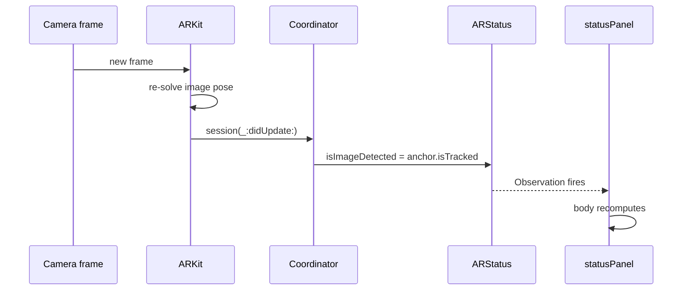

# How PostcardAR works

A walkthrough of the whole app, written for someone who can program but has not used SwiftUI
before. It covers the SwiftUI mental model first, because most of what looks strange in the
code is SwiftUI convention rather than anything to do with AR.

The entire app is four files and about 200 lines.

| File | Job |
|---|---|
| `PostcardARApp.swift` | Entry point. Names the first screen. |
| `ContentView.swift` | The button, and the camera screen's overlay. |
| `PostcardARView.swift` | Everything AR: session, anchor, model loading, scaling. |
| `Assets.xcassets` | The reference image and its real-world size. |

---

## Part 1 — The SwiftUI mental model

If you come from imperative UI (UIKit, Android Views, DOM manipulation, Swing), the habit is:
create a widget object, keep a reference, mutate it when data changes. `label.text = "hi"`.

SwiftUI inverts that. You never hold a widget and you never mutate one.

### Views are values, not objects

```swift
struct ContentView: View {
    var body: some View { ... }
}
```

`ContentView` is a **struct** — a value type. It is not the button on screen. It is a
*description* of what should be on screen, and it is cheap to create and throw away.

The framework calls `body`, gets a tree of description values, diffs it against the previous
description, and updates the real underlying widgets itself. Think React's virtual DOM, or an
immediate-mode GUI with retained-mode performance underneath.

The practical consequence: **`body` runs constantly**, potentially many times a second. So

- `body` must be cheap and free of side effects.
- You cannot store mutable state in a plain `var` on the struct. It gets discarded on the next
  recomputation, and structs passed into `body` are immutable anyway.

That second point is why property wrappers exist.

### `some View`

`some View` means "one specific concrete type conforming to `View`, chosen by the compiler,
that I am not going to spell out." It is an opaque return type.

It exists because SwiftUI's real types are absurd. A `VStack` holding a `Label` and a `Text` is
literally typed `VStack<TupleView<(Label<Text, Image>, Text)>>`, and every modifier wraps it
further. `some View` lets you skip writing that, while still giving the compiler one static
type to optimise against. It is not type erasure and it is not a protocol existential.

### Modifiers wrap, they don't mutate

```swift
Button("Start Scanning") { ... }
    .buttonStyle(.borderedProminent)
    .controlSize(.large)
```

`.buttonStyle(...)` does not set a property on the button. It returns a **new value** that
wraps the button and carries that styling. Each line wraps the result of the previous one, so
this is nested composition written as a chain — closer to `controlSize(buttonStyle(button))`
than to a sequence of setters.

Order therefore matters. `.padding().background(.red)` gives a red area including the padding;
`.background(.red).padding()` gives a red area inside it, with transparent padding around.

### State: `@State`

```swift
@State private var isScanning = false
```

`@State` is a property wrapper. It means: *SwiftUI, you own this storage, not the struct.*

The value lives in framework storage attached to this view's position in the tree, so it
survives every recomputation of `body`. When you write to it, SwiftUI marks the view dirty and
schedules a recomputation. **Writing state is what causes redrawing.** There is no
`setNeedsDisplay`, no `invalidate()`.

`@State` is for state a view *owns*. Always `private`.

### `$` and bindings

```swift
.fullScreenCover(isPresented: $isScanning) { ScannerScreen() }
```

`isScanning` is the `Bool`. `$isScanning` is a `Binding<Bool>` — a read/write reference to that
storage, roughly a getter/setter pair boxed into a value.

The distinction matters because the cover needs to *write* the flag, not just read it. Swiping
the sheet down sets it back to `false` from the inside. Passing the raw `Bool` would only pass
a copy, and the dismissal could never propagate back.

Rule of thumb: plain name to read, `$name` to hand someone else write access.

### Shared state: `@Observable`

`@State` handles one view's own value. `ARStatus` is different — it is written by an ARKit
callback living outside the view hierarchy entirely, and read by the overlay.

```swift
@Observable
final class ARStatus {
    var isImageDetected = false
    var isModelLoaded = false
    var errorMessage: String?
}
```

`@Observable` is a macro. At compile time it rewrites every stored property into a
get/set pair that reports reads and writes to the Observation framework.

That gives automatic, **property-level** dependency tracking. When SwiftUI runs `body`, it
records which properties were actually read. When one of those is written, only the views that
read *that specific property* recompute. You never declare the dependency; reading it is the
declaration.

It is a `class`, not a struct, precisely because it needs reference semantics — the coordinator
and the view must see the same instance.

```swift
@State private var status = ARStatus()
```

`@State` here owns the *reference*, keeping the object alive across recomputations.
`@Observable` handles the change notifications. The two do different jobs.

---

## Part 2 — Walking the app

### Entry point

```swift
@main
struct PostcardARApp: App {
    var body: some Scene {
        WindowGroup { ContentView() }
    }
}
```

`@main` marks the program entry point. `App` is the top-level protocol; `Scene` is a window's
worth of UI. `WindowGroup` is the standard one — full screen on iOS, a real window on macOS.

### The button

```swift
struct ContentView: View {
    @State private var isScanning = false

    var body: some View {
        Button("Start Scanning") { isScanning = true }
            .buttonStyle(.borderedProminent)
            .controlSize(.large)
            .fullScreenCover(isPresented: $isScanning) { ScannerScreen() }
    }
}
```

Tapping sets `isScanning = true` → SwiftUI recomputes `body` → `fullScreenCover` now sees
`true` → it builds `ScannerScreen()` and presents it.

Note what is absent: no navigation controller, no present call, no segue. You changed a
boolean and described what should be true when it is true. That is the whole paradigm.

### The camera screen

```swift
private struct ScannerScreen: View {
    @Environment(\.dismiss) private var dismiss
    @State private var status = ARStatus()

    var body: some View {
        PostcardARView(status: status)
            .ignoresSafeArea()
            .overlay(alignment: .top) { statusPanel }
            .overlay(alignment: .bottom) { Button("Close") { dismiss() } ... }
    }
}
```

`@Environment(\.dismiss)` pulls a value out of the environment — an implicit dictionary passed
down the view tree, similar to React context. SwiftUI puts a dismiss action in there for any
presented view, so the screen can close itself without knowing who presented it or holding a
binding back to it.

`.overlay` stacks a view on top of another, aligned within its frame — the same idea as
`ZStack`, but anchored to this specific view's bounds.

---

## Part 3 — Bridging to UIKit

RealityKit's `ARView` is a UIKit class (`UIView`), and SwiftUI cannot render one directly. The
bridge is a protocol:

```swift
struct PostcardARView: UIViewRepresentable {
    func makeUIView(context: Context) -> ARView { ... }
    func updateUIView(_ uiView: ARView, context: Context) { }
    func makeCoordinator() -> Coordinator { ... }
}
```

Three responsibilities:

| Method | When | Purpose |
|---|---|---|
| `makeUIView` | **Once**, on first appearance | Create and configure the UIKit view |
| `updateUIView` | Every time SwiftUI state it depends on changes | Push new values into the existing view |
| `makeCoordinator` | Once, before `makeUIView` | Create a persistent object for delegates |

`updateUIView` is empty here. Everything the AR view needs is set up once, and after that
ARKit drives itself from the camera rather than from SwiftUI state. Data flows *out* of the
AR view into the UI, not in. Leaving it empty is correct, not an omission.

### Why a coordinator exists

`PostcardARView` is a struct that gets destroyed and recreated on every recomputation. So it
cannot be a delegate — delegates are held weakly and must outlive the call that registers them.

The coordinator is a **class**, created once, owned by SwiftUI for the lifetime of the view.
That gives you a stable object to hand to old-style Objective-C APIs that expect delegates,
targets, or data sources. It is the standard escape hatch from value-type UI into
reference-type frameworks.

```swift
arView.session.delegate = context.coordinator
```

---

## Part 4 — How the AR actually works

### ARKit vs RealityKit

Two frameworks with a clean split:

- **ARKit** understands the real world. It runs the camera, fuses it with the motion sensors,
  and reports what it found. It draws nothing.
- **RealityKit** draws 3D. It owns the scene graph, meshes, materials, lighting, physics.

`ARView` is RealityKit's view, and it holds an `ARSession` from ARKit. ARKit says where things
are; RealityKit puts pixels there.

### The session and its configuration

```swift
let configuration = ARImageTrackingConfiguration()
configuration.trackingImages = referenceImages
configuration.maximumNumberOfTrackedImages = 1
arView.session.run(configuration)
```

`ARSession` is the running tracking loop. The **configuration** tells it what job to do, and
the class you pick determines the whole behaviour:

| Configuration | Behaviour |
|---|---|
| `ARWorldTrackingConfiguration` | Maps the room, tracks the device in it. Images can be detected once, then the anchor stays put in world space. |
| `ARImageTrackingConfiguration` | Ignores the room entirely. Locates the image relative to the camera, every frame. |

We use image tracking because the postcard **moves**. World tracking assumes what it detected
stays where it was — correct for a poster on a wall, wrong for a card in your hand, which would
leave the model floating where the card used to be.

`automaticallyConfigureSession = false` stops `ARView` from helpfully replacing our
configuration with its default world-tracking one.

### Anchors

An **anchor** is ARKit's word for "a tracked position in the real world." Each frame, ARKit
re-solves the pose of everything it is tracking and updates the corresponding anchors.

`ARImageAnchor` is the image-specific kind. Two useful members:

- `transform` — a 4×4 matrix: position and orientation of the image in space.
- `isTracked` — whether it is *currently* visible. Goes false when the card leaves frame, true
  again when it returns. The anchor object survives in between.

### RealityKit's scene graph

RealityKit is an **entity-component system**. An `Entity` is an identity with a transform;
what it *is* comes from components attached to it (`ModelComponent` for a mesh,
`CollisionComponent` for hit-testing, and so on).

Entities form a tree, and **a child's transform is relative to its parent** — the standard
scene-graph composition. This one fact is what makes the whole app work:

```
AnchorEntity(.image)      ← ARKit writes the card's pose here, every frame
  └── model               ← we set scale and position here, once
```

`AnchorEntity` is an `Entity` subclass bound to an AR anchor target. RealityKit finds the
matching `ARImageAnchor` and copies its transform into the entity continuously.

The model is a child. Its own transform is small and fixed — "scaled this much, sitting on the
surface." Compose the two and you get the model's actual world position.

**So "the model follows the postcard" is not a feature anyone implemented.** It is parenting.
Rotate the card, ARKit updates the anchor, the child inherits it. There is no per-frame code in
this project at all.

The corollary: never write to the anchor's transform. ARKit owns it and overwrites it on the
next frame. If you ever need to move the model independently, insert a pivot entity between
anchor and model and write to the pivot.

---

## Part 5 — Sizing the model

### The problem

A `.usdz` stores real-world units. RealityKit honours them literally: a model authored two
metres tall renders two metres tall, hanging over a 15 cm postcard.

Nothing connects the two. The anchor supplies position and rotation, never scale. The card's
physical size positions the anchor and never touches the model. They are independent, which is
exactly why the model appears at an arbitrary size.

### The fix

Rather than demand every `.usdz` be authored at the correct size, measure it at load time and
derive the scale from the card:

```swift
let bounds = model.visualBounds(relativeTo: nil)
let scale = cardWidth * modelWidthRelativeToCard / bounds.extents.x
model.scale = .init(repeating: scale)

model.position = [
    -bounds.center.x * scale,
    (bounds.extents.y / 2 - bounds.center.y) * scale,
    -bounds.center.z * scale
]
```

`visualBounds` returns a `BoundingBox` with a `center` and `extents` (full width, not half),
computed over the entity and all its descendants.

The scale line is straightforward: to make width `extents.x` become `cardWidth`, multiply by
their ratio.

The position line handles a detail that bites everyone: **the `.usdz` origin is wherever the
artist left it.** Often it is at the model's feet, sometimes off to one side, rarely at the
centre. Assuming it is centred is why models show up half-buried or floating beside the card.

So we measure and correct. In the anchor's coordinate space, x runs across the card's width,
z down its height, and y points out of its surface. A point `p` in the model lands at
`scale * p + position`. Solving for what we want:

- **Centred on the card** — put the box centre at the origin in x and z:
  `scale * center + position = 0`, so `position = -scale * center`.
- **Standing on the card** — put the box *bottom* at y = 0. The bottom is
  `center.y - extents.y / 2`, so `position.y = scale * (extents.y / 2 - center.y)`.

Which is the code above.

The payoff is that the model's authored scale stops mattering. Export from Blender at any size;
it still lands correctly. One constant tunes it:

```swift
private let modelWidthRelativeToCard: Float = 1.0
```

The trade-off: the card's physical size now controls the model's **size** as well as its
distance, so an inaccurate measurement is more visible than it used to be.

---

## Part 6 — The status indicator

This is the one place data flows back from AR into SwiftUI, and it is worth following end to
end because it exercises every concept above.



The coordinator is a plain `ARSessionDelegate`:

```swift
func session(_ session: ARSession, didUpdate anchors: [ARAnchor]) {
    guard let imageAnchor = anchors.compactMap({ $0 as? ARImageAnchor }).first else { return }
    status.isImageDetected = imageAnchor.isTracked
}
```

`compactMap` with `as?` filters the array down to image anchors — `didUpdate` hands you every
anchor kind, so you narrow to the one you care about.

These callbacks arrive **on the main thread**, because `session.delegateQueue` is left nil and
ARKit's documented behaviour then is to use the main queue. That is why there is no dispatching
here. If you ever set a custom queue, this code would need to hop back before touching UI state.

Then the chain: the write hits an `@Observable` property → Observation notifies whoever read it
→ `statusPanel` read `status.isImageDetected` during its last `body` → SwiftUI recomputes it →
the label flips to green.

No delegate protocol between the AR view and the UI, no notification centre, no manual refresh.
The dependency was established simply by reading the property.

Tracking two things separately is deliberate. When nothing appears on screen, the first
question is always *which half failed* — the image was never recognised, or the model never
loaded. One combined "working / not working" flag cannot answer that.

---

## Part 7 — Things worth knowing

**Async model loading.** `Entity(named:in:)` is `async` and can take seconds on a large file.
It runs in a `Task { @MainActor in ... }` so `makeUIView` returns immediately and the camera
appears while loading continues. The anchor is added to the scene empty and gains its child
later — perfectly legal, RealityKit renders whatever is there each frame.

**Only a real device.** The simulator has no camera feed. `ARImageTrackingConfiguration.isSupported`
is false there, and the guard turns what would be a crash into a visible message.

**Reference image quality decides everything.** ARKit matches feature points and needs them
spread across the whole image. Flat colour, smooth gradients, and white backgrounds have none.
Xcode's asset-catalog warnings are the authority; treat them as failures, not advice. See
`setup.md`.

**Physical size does not affect detection.** Feature matching is scale-invariant — ARKit finds
the image whatever number is in that field. The size only converts the 2D match into a 3D pose,
and now also drives the model's scale. So a wrong value means "wrong size or distance", never
"nothing detected". If nothing is detected, it is always the image.

**SourceKit lies in this project.** The editor sometimes reports `Cannot find type
'UIViewRepresentable'` and similar. That is the indexer resolving against the macOS SDK. The
compiler is the authority — `xcodebuild` builds clean.
